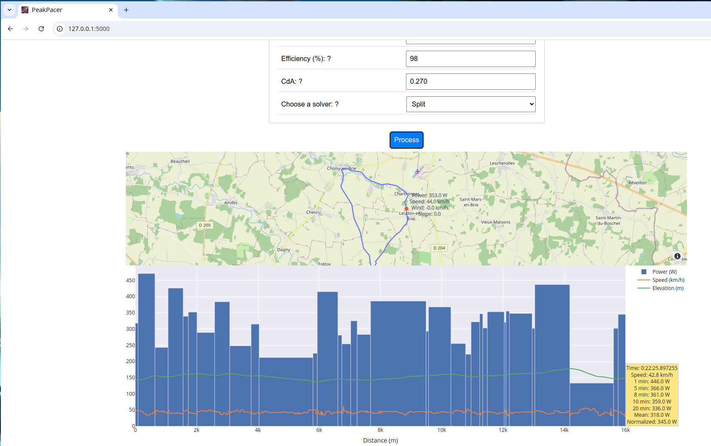
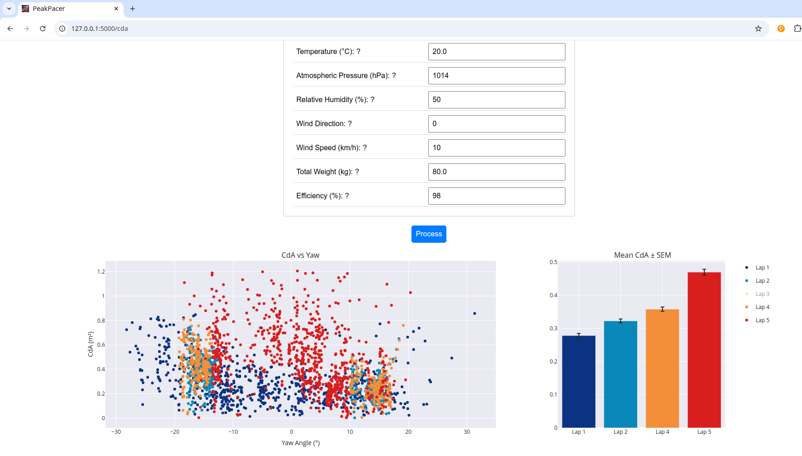

# PeakPacer

**PeakPacer** is a Python-based tool that optimizes cycling performance by providing insights and calculations to help cyclists maximize speed while minimizing energy expenditure. It offers two core functionalities:

1. **Power Profile Optimization:** Given a GPX file representing a parcours (a GPS route), PeakPacer calculates the optimal power distribution to maintain for maximizing speed while minimizing total power output over the course of the ride.
2. **CdA Computation:** Given a FIT file containing cycling data, PeakPacer calculates the CdA, which is a crucial aerodynamic factor affecting performance.

## Features

### 1. **Power Profile Optimization (GPX Input)**
- Takes a GPX file as input, which defines a cycling route.
- Analyzes route elevation changes, distances, and slopes.
- Computes the ideal power profile a cyclist should maintain for each segment of the ride to:
  - Maximize speed
  - Minimize power output based on athlete FTP and MAP.

This helps cyclists distribute their energy efficiently during climbs, descents, and flats, leading to better overall performance.



### 2. **CdA Computation (FIT Input)**
- Takes a FIT file containing real-world cycling data (speed, power, elevation, etc.) as input.
- Analyzes the data to calculate the cyclist and bike CdA, which is a key metric used to measure aerodynamic efficiency.
- Provides insight into how different positions, clothing, or equipment changes might affect overall performance by reflecting changes in CdA during field tests.



## Installation

1. Clone the repository:
   ```bash
   git clone https://github.com/bgallois/PeakPacer.git
   cd peakpacer
   ```

2. Install dependencies:
   ```bash
   pip install -r requirements.txt
   ```

## Usage

### Running the Web Interface

1. To start the Flask application:
   ```bash
   flask --app app --debug run
   ```

2. Visit the following URLs:
   - For Power Profile Optimization: [http://127.0.0.1:5000](http://127.0.0.1:5000)
   - For CdA Computation: [http://127.0.0.1:5000/cda](http://127.0.0.1:5000/cda)

## Output

- For **Power Profile Optimization**, PeakPacer outputs:
  - Optimal power profile per split or segment.
  - Power output time distribution.

- For **CdA Computation**, PeakPacer outputs:
  - Calculated CdA by laps.
  - Graphs showing how CdA changes across yaw angles.
